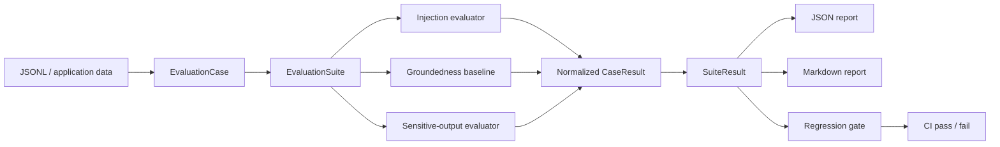

# Architecture

SentinelAI separates evaluation semantics from model execution. The core evaluates recorded prompts and responses with no network access, API key, or dependency on a model provider. That boundary keeps the v0.1 regression path deterministic, inspectable, and suitable for CI.

## System view



## Engineering invariants

| Concern | SentinelAI behavior |
| --- | --- |
| Provider independence | Recorded outputs can be evaluated without network access or vendor credentials. |
| Evaluator composition | Evaluators share a normalized result contract rather than owning report or CLI behavior. |
| Determinism | The same cases, evaluator configuration, and inputs are intended to produce repeatable regression results. |
| Parallel execution | Case evaluation may run in a bounded thread pool while result ordering remains stable for reporting. |
| Prompt-injection scope | v0.1 detects explicit heuristic signals; it does not claim complete prompt-injection prevention. |
| Groundedness scope | Lexical overlap is a transparent regression baseline, not a semantic factuality oracle. |
| Sensitive output | Findings report the leak class while matched credential-shaped values are redacted. |
| Untrusted data | Prompts, responses, context, and future traces are treated as data to analyze, not instructions to execute. |
| Regression gating | Baseline/current comparisons fail on configured score drops or newly failing cases. |
| Offline safety | The evaluation core does not execute model/tool calls as part of scoring. |
| Verification | Ruff, Mypy, Pytest, Python 3.11/3.12/3.13 CI, CodeQL, and SonarQube Cloud cover the current implementation. |
| Supply chain | Third-party GitHub Actions used by CI, security analysis, and packaging are pinned to reviewed immutable commits. |

## Evaluation flow

```text
JSONL / Application Data
          |
          v
+-----------------------+
| EvaluationCase        |
+-----------------------+
          |
          v
+-----------------------+
| EvaluationSuite       |
| deterministic /       |
| bounded parallelism   |
+-----------------------+
    |        |        |
    v        v        v
 Injection Grounded  Sensitive
 signals   baseline   output
    \        |        /
     \       |       /
      v      v      v
+-----------------------+
| CaseResult            |
+-----------------------+
          |
          v
+-----------------------+
| SuiteResult           |
+-----------------------+
    |              |
    v              v
 JSON/Markdown     Regression gate
```

## Design boundaries

### Evaluation cases are provider-neutral

A case contains a prompt, recorded response, optional grounding context, and metadata. The evaluator contract does not require a live model client.

### Evaluators are composable

Each evaluator returns normalized score/pass/fail information, findings, and metrics. Reporting and regression comparison operate on those normalized results instead of reaching into evaluator-specific internals.

### Heuristics are labeled as heuristics

The prompt-injection evaluator recognizes explicit instruction-override, exfiltration, and bypass-shaped signals. The groundedness evaluator is a deterministic lexical regression baseline. Neither is presented as a complete security or factuality solution.

### Sensitive findings are report-safe

Credential-shaped findings identify the category of the match while redacting the matched value before it reaches human-readable or machine-readable output.

### Parallelism does not redefine semantics

The runner can evaluate cases concurrently with `ThreadPoolExecutor`, but reports remain tied to the input case sequence rather than completion timing. Parallel execution is a throughput option, not a scoring semantic.

### Regression is a first-class contract

Stored reports can be compared with current results. The comparison layer detects configured score degradation and newly failing cases so AI behavior changes can participate in CI like other software regressions.

## Trust boundary

SentinelAI treats evaluation datasets as untrusted input. Text inside prompts, responses, context, and future agent traces is never interpreted as an instruction to the evaluator runtime. v0.1 has no provider adapter or tool executor in the scoring path, so an adversarial dataset cannot cause the core evaluator to call a model or tool simply because the text asks it to.

This does not make arbitrary files safe to open in every surrounding application. Hosts are still responsible for filesystem permissions, secret handling, and container/runtime policy.

## Explicit non-claims

SentinelAI v0.1 does not claim:

- complete prompt-injection prevention;
- semantic hallucination or factuality detection;
- production DLP or secret-scanning coverage;
- adversarial robustness certification;
- that an offline deterministic baseline replaces model-assisted evaluation.

Those boundaries are deliberate. Future provider adapters and semantic judges should remain outside the deterministic evaluator contract so recorded-output regression testing continues to work without network access.
